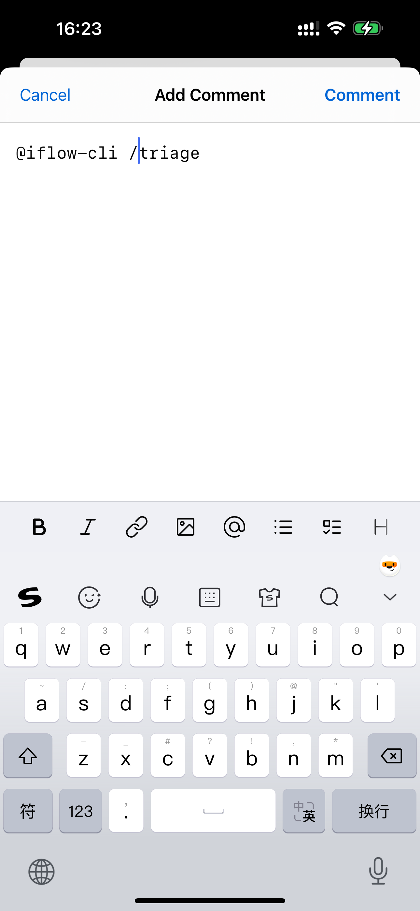

# AI Works 效率提升 - iFlow CLI Action 使用攻略

<!-- TOC start -->
## Table of Contents

- [特性](#特性)
- [快速开始](#快速开始)
- [更多示例工作流](#更多示例工作流)
  - [IFLOW.md](#iflowmd)
  - [善于使用 GitHub 移动端](#善于使用-github-移动端)
  - [安全考虑](#安全考虑)
  - [GitHub Actions 使用成本](#github-actions-使用成本)
- [故障排查](#故障排查)
  - [iFLOW CLI 执行摘要报告](#iflow-cli-执行摘要报告)
  - [超时](#超时)
- [社区使用案例](#社区使用案例)

[Back to Table of Contents](README.md#table-of-contents)
<!-- TOC end -->


通过 iFLOW CLI Action，可以让 [iFLOW CLI](https://platform.iflow.cn/cli/quickstart) 化身为您的 GitHub 开源项目开发伙伴. 您可以自定义任意灵活多变的工作流，智能化 & 自动化处理 issues、PRs、README 文档等.

您也可以通过对话式的方式触发 iFLOW CLI 的执行, 比如在 bug issue 中评论 `@iflow-cli fix this issue` 即可触发智能化工作流帮您修复 BUG.

## 特性

- 基于 Docker/VM 的天然隔离环境执行 iFLOW CLI, “并行”执行 iFLOW CLI;
- 甚至可以通过 [Self-hosted runners](https://docs.github.com/en/actions/concepts/runners/self-hosted-runners) 调度到自己的机器上;
- “天然”的移动端支持, 移动端 GitHub APP 对话式触发 iFLOW CLI 执行任务, 处理您的 GitHub 代码库 issues、PRs;
- **iFLOW CLI 执行摘要报告集成**：在 GitHub Actions 执行历史中格式化 iFLOW CLI 执行日志信息.

## 快速开始

**这里我们以一个智能化对 GitHub issues 打标分类的自动化工作流为例:**


1. 在 [心流个人资料获取页面](https://iflow.cn/?open=setting) 获取您的 iFLOW CLI API 访问密钥.
2. 将访问密钥以 GitHub 仓库密钥的形式添加到您的代码仓库中  (Settings -> Secrets and variables -> Actions -> New repository secret, Secret 密钥名为 `IFLOW_API_KEY`), 👉🏻 [了解如何使用 GitHub 仓库密钥](https://docs.github.com/zh/actions/how-tos/write-workflows/choose-what-workflows-do/use-secrets)).
3. 在您的代码仓库中创建 `.github/workflows/issue-triage.yml` 文件, 并添加以下内容:

```yaml
name: '🏷️ iFLOW CLI Automated Issue Triage'

on:
  issues:
    types:
      - 'opened'
      - 'reopened'
  issue_comment:
    types:
      - 'created'
  workflow_dispatch:
    inputs:
      issue_number:
        description: 'issue number to triage'
        required: true
        type: 'number'

concurrency:
  group: '${{ github.workflow }}-${{ github.event.issue.number }}'
  cancel-in-progress: true

defaults:
  run:
    shell: 'bash'

permissions:
  contents: 'read'
  issues: 'write'
  statuses: 'write'

jobs:
  triage-issue:
    if: |-
      github.event_name == 'issues' ||
      github.event_name == 'workflow_dispatch' ||
      (
        github.event_name == 'issue_comment' &&
        contains(github.event.comment.body, '@iflow-cli /triage') &&
        contains(fromJSON('["OWNER", "MEMBER", "COLLABORATOR"]'), github.event.comment.author_association)
      )
    timeout-minutes: 5
    runs-on: 'ubuntu-latest'
    steps:
      - name: Checkout repository
        uses: actions/checkout@v4

      - name: 'Run iFlow CLI Issue Triage'
        uses: vibe-ideas/iflow-cli-action@main
        id: 'iflow_cli_issue_triage'
        env:
          GITHUB_TOKEN: '${{ secrets.GITHUB_TOKEN }}'
          ISSUE_TITLE: '${{ github.event.issue.title }}'
          ISSUE_BODY: '${{ github.event.issue.body }}'
          ISSUE_NUMBER: '${{ github.event.issue.number }}'
          REPOSITORY: '${{ github.repository }}'
        with:
          api_key: ${{ secrets.IFLOW_API_KEY }}
          timeout: "3600"
          extra_args: "--debug"
          prompt: |
            ## Role

            You are an issue triage assistant. Analyze the current GitHub issue
            and apply the most appropriate existing labels. Use the available
            tools to gather information; do not ask for information to be
            provided.

            ## Steps

            1. Run: `gh label list` to get all available labels.
            2. Review the issue title and body provided in the environment
               variables: "${ISSUE_TITLE}" and "${ISSUE_BODY}".
            3. Classify issues by their kind (bug, enhancement, documentation,
               cleanup, etc) and their priority (p0, p1, p2, p3). Set the
               labels according to the format `kind/*` and `priority/*` patterns.
            4. Apply the selected labels to this issue using:
               `gh issue edit "${ISSUE_NUMBER}" --add-label "label1,label2"`
            5. If the "status/needs-triage" label is present, remove it using:
               `gh issue edit "${ISSUE_NUMBER}" --remove-label "status/needs-triage"`

            ## Guidelines

            - Only use labels that already exist in the repository
            - Do not add comments or modify the issue content
            - Triage only the current issue
            - Assign all applicable labels based on the issue content
            - Reference all shell variables as "${VAR}" (with quotes and braces)

      - name: 'Post Issue Triage Failure Comment'
        if: |-
          ${{ failure() && steps.iflow_cli_issue_triage.outcome == 'failure' }}
        uses: 'actions/github-script@60a0d83039c74a4aee543508d2ffcb1c3799cdea'
        with:
          github-token: '${{ secrets.GITHUB_TOKEN }}'
          script: |-
            github.rest.issues.createComment({
              owner: '${{ github.repository }}'.split('/')[0],
              repo: '${{ github.repository }}'.split('/')[1],
              issue_number: '${{ github.event.issue.number }}',
              body: 'There is a problem with the iFlow CLI issue triaging. Please check the [action logs](${{ github.server_url }}/${{ github.repository }}/actions/runs/${{ github.run_id }}) for details.'
            })
```

这是一个利用 iFLOW CLI Action 对 GitHub issues 内容进行识别, 然后进行自动打标签分类的工作流程, 一但您的代码仓库中有新的 issue 创建, 改工作流就会自动执行. 您也可以 issue 中评论回复 `@iflow-cli /triage` 即可触发该工作流.

```mermaid
sequenceDiagram
    participant 用户 as 用户/GitHub
    participant 触发器 as GitHub触发器
    participant 工作流 as GitHub Actions工作流
    participant 动作 as iFlow CLI Action
    participant 分析器 as iFlow CLI智能分析
    participant API as GitHub API

    用户->>触发器: 创建/重新打开Issue 或 评论"@iflow-cli /triage"
    触发器->>工作流: 触发issue-triage工作流
    工作流->>动作: 执行iFlow CLI Issue Triage步骤
    动作->>动作: 设置环境变量(ISSUE_TITLE, ISSUE_BODY等)
    
    动作->>分析器: 启动iFlow CLI进行分析
    分析器->>API: 执行: gh label list (获取可用标签)
    API-->>分析器: 返回仓库标签列表
    分析器->>分析器: 分析Issue标题和内容
    分析器->>API: 执行: gh issue edit --add-label "kind/xxx,priority/xxx"
    API-->>分析器: 标签应用成功
    
    alt 存在"status/needs-triage"标签
        分析器->>API: 执行: gh issue edit --remove-label "status/needs-triage"
        API-->>分析器: 标签移除成功
    end
    
    分析器-->>动作: 返回分析完成状态
    
    alt 分析失败
        动作->>API: 通过github-script创建失败评论
        API-->>用户: 在Issue中发布失败通知和日志链接
    end
    
    动作-->>工作流: 步骤完成
    工作流-->>触发器: 工作流执行结束
    触发器-->>用户: 更新Issue状态
```

## 更多示例工作流

[examples](../examples) 目录中提供了完整基于 GitHub issues、GitHub Pull Requests 更多使用场景的自动化工作流程编排文件 (比如: [自动处理 issue](https://github.com/iflow-ai/iflow-cli-action/pull/26)、自动评审等), 您可以直接拷贝到您代码仓库的 `.github/workflows` 目录中直接使用.

## 最佳实践

### IFLOW.md

在您的仓库根目录中创建一个 IFLOW.md 文件来定义代码风格指南、代码评审标准、项目特定规则. 此文件将指导 iFLOW CLI 理解您的项目标准. 同时可以更便于 iFLOW CLI Action 执行自动化任务.

### 善于使用 GitHub 移动端

GitHub 提供了移动端的 APP (您可以在 iOS APP Store 或者 Google Play 应用商店下载 [https://github.com/mobile](https://github.com/mobile)) 方便我们在手机移动端也可以管理代码仓库, 处理 issues 或者进行代码评审任务. 同样我们也可以通过 APP 随时随地的触发我们的 iFLOW CLI 智能自动化工作流.

| 移动端评论触发 | 移动端查看工作流 |
|---|---|
|  |  |

### 安全考虑

**永远不要将 API 密钥提交到代码仓库中!**

始终使用 GitHub 密钥（例如, `${{ secrets.IFLOW_API_KEY }}`）而不是在工作流程文件中直接硬编码 iFLOW CLI 的 API 密钥, 如果您的代码仓库是公开的，这非常危险, 其他人可能可以通过 GitHub Actions 日志日志等手段获取到您的密钥.

### GitHub Actions 使用成本

GitHub Actions 对于个人账号和组织账号均有不同的免费额度, 详情请查阅 [GitHub Actions 的计费文档](https://docs.github.com/zh/billing/concepts/product-billing/github-actions).

### 通过传统的自动化手段去兜底代码质量

AI 生成的内容面对复杂任务仍然会出现不可靠行为, 传统的单元测试、集成测试、代码扫描自动化工作流仍然非常有用. 代码评审时, 仍然需要这些工具 + 人工审阅去确保代码质量.

## 故障排查

### iFLOW CLI 执行摘要报告

iFLOW CLI Action 提供了执行摘要报告可以方便您去定义一些因为版本或者依赖环境导致的问题 [查看示例](https://github.com/iflow-ai/iflow-cli-action/actions/runs/17186351886)


### 超时

iFLOW CLI Action 默认会控制自动化任务的执行时间在 3600 秒 (一小时内), 如果您的任务执行时间超过此时间, 可以调整 `with.timeout` 参数.

## 社区使用案例

- [使用 iflow-cli-action 在 GitHub 与 Qwen3-Coder、Kimi K2 一起快速提升你的生产力](https://shan333.cn/2025/08/16/the-next-level-of-developer-productivity-with-iflow-cli-action/)
- [定时生成不同设计风格周刊列表网站](https://awesome-tech-weekly-zh.netlify.app/)

> 欢迎提交您的使用案例
