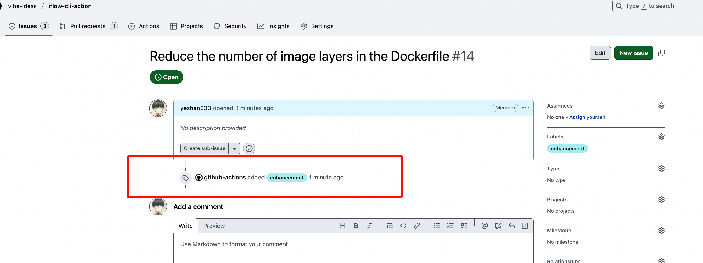
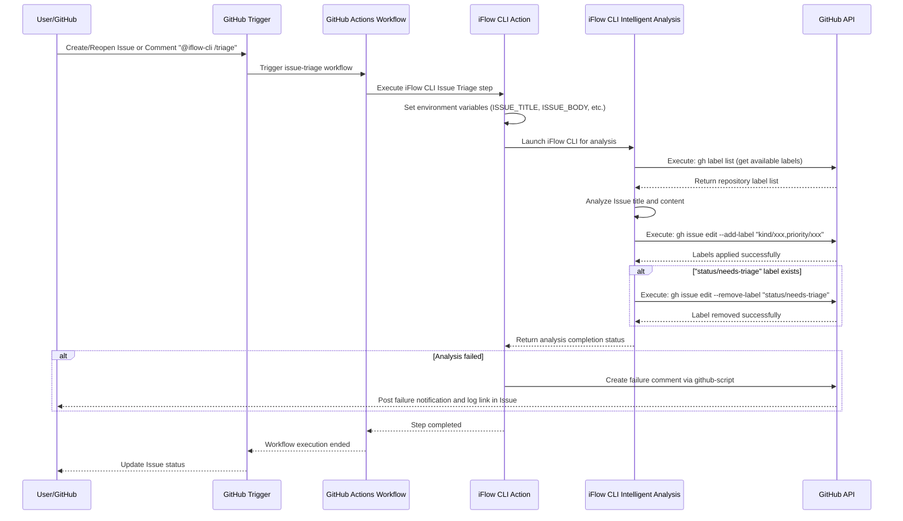
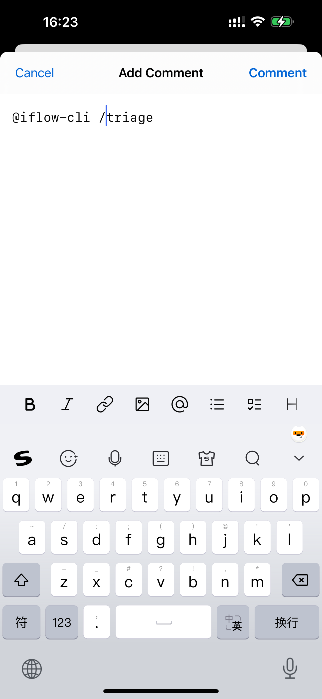
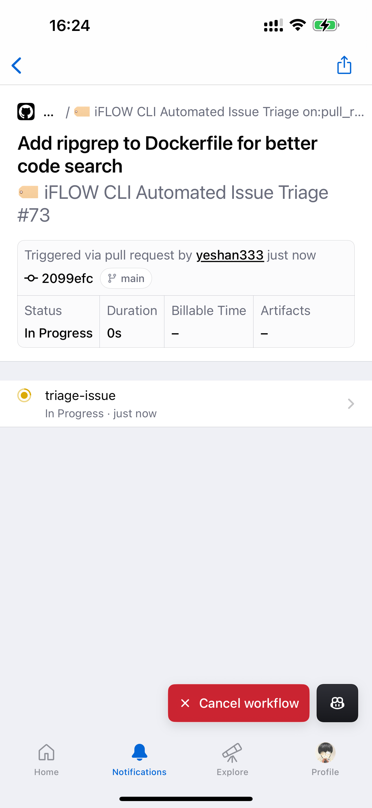
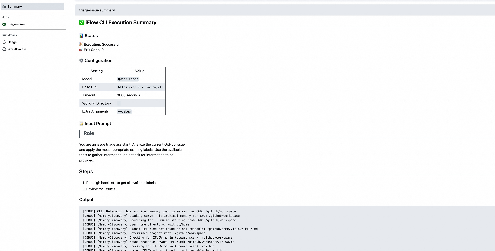

# AI Works Productivity Enhancement - iFlow CLI Action Usage Guide

<!-- TOC start -->
## Table of Contents

- [Features](#features)
- [Quick Start](#quick-start)
- [More Example Workflows](#more-example-workflows)
- [Best Practices](#best-practices)
  - [IFLOW.md](#iflowmd)
  - [Leveraging GitHub Mobile](#leveraging-github-mobile)
  - [Security Considerations](#security-considerations)
  - [GitHub Actions Cost](#github-actions-cost)
  - [Backing Up Code Quality with Traditional Automation](#backing-up-code-quality-with-traditional-automation)
- [Troubleshooting](#troubleshooting)
  - [iFLOW CLI Execution Summary Report](#iflow-cli-execution-summary-report)
  - [Timeout](#timeout)
- [Community Use Cases](#community-use-cases)

[Back to Table of Contents](README.md#table-of-contents)
<!-- TOC end -->


With iFLOW CLI Action, you can transform [iFLOW CLI](https://platform.iflow.cn/cli/quickstart) into your GitHub open source project development partner. You can customize any flexible workflow to intelligently & automatically handle issues, PRs, README documents, etc.

You can also trigger iFLOW CLI execution through conversational methods. For example, commenting `@iflow-cli fix this issue` in a bug issue will trigger an intelligent workflow to help you fix the BUG.

## Features

- Execute iFLOW CLI in a naturally isolated environment based on Docker/VM, enabling "parallel" execution of iFLOW CLI;
- Can even be scheduled to your own machine through [Self-hosted runners](https://docs.github.com/en/actions/concepts/runners/self-hosted-runners);
- "Native" mobile support, triggering iFLOW CLI execution tasks through conversational interactions in the mobile GitHub APP to handle GitHub repository issues and PRs;
- **iFLOW CLI Execution Summary Report Integration**: Format iFLOW CLI execution log information in GitHub Actions execution history.

## Quick Start

**Here we'll use an automated workflow for intelligent GitHub issues labeling and classification as an example:**



1. Get your iFLOW CLI API access key at [HeartFlow personal profile page](https://iflow.cn/?open=setting).
2. Add the access key to your code repository as a GitHub repository secret (Settings -> Secrets and variables -> Actions -> New repository secret, with secret name `IFLOW_API_KEY`), 👉🏻 [Learn how to use GitHub repository secrets](https://docs.github.com/en/actions/how-tos/write-workflows/choose-what-workflows-do/use-secrets)).
3. Create `.github/workflows/issue-triage.yml` file in your code repository and add the following content:

```yaml
name: '🏷️ iFLOW CLI Automated Issue Triage'

on:
  issues:
    types:
      - 'opened'
      - 'reopened'
  issue_comment:
    types:
      - 'created'
  workflow_dispatch:
    inputs:
      issue_number:
        description: 'issue number to triage'
        required: true
        type: 'number'

concurrency:
  group: '${{ github.workflow }}-${{ github.event.issue.number }}'
  cancel-in-progress: true

defaults:
  run:
    shell: 'bash'

permissions:
  contents: 'read'
  issues: 'write'
  statuses: 'write'

jobs:
  triage-issue:
    if: |-
      github.event_name == 'issues' ||
      github.event_name == 'workflow_dispatch' ||
      (
        github.event_name == 'issue_comment' &&
        contains(github.event.comment.body, '@iflow-cli /triage') &&
        contains(fromJSON('[\"OWNER\", \"MEMBER\", \"COLLABORATOR\"]'), github.event.comment.author_association)
      )
    runs-on: 'ubuntu-latest'
    steps:
      - name: Checkout repository
        uses: actions/checkout@v4

      - name: 'Run iFlow CLI Issue Triage'
        uses: vibe-ideas/iflow-cli-action@main
        id: 'iflow_cli_issue_triage'
        env:
          GITHUB_TOKEN: '${{ secrets.GITHUB_TOKEN }}'
          ISSUE_TITLE: '${{ github.event.issue.title }}'
          ISSUE_BODY: '${{ github.event.issue.body }}'
          ISSUE_NUMBER: '${{ github.event.issue.number }}'
          REPOSITORY: '${{ github.repository }}'
        with:
          api_key: ${{ secrets.IFLOW_API_KEY }}
          timeout: "3600"
          debug: "true"
          prompt: |
            ## Role

            You are an issue triage assistant. Analyze the current GitHub issue
            and apply the most appropriate existing labels. Use the available
            tools to gather information; do not ask for information to be
            provided.

            ## Steps

            1. Run: `gh label list` to get all available labels.
            2. Review the issue title and body provided in the environment
               variables: "${ISSUE_TITLE}" and "${ISSUE_BODY}".
            3. Classify issues by their kind (bug, enhancement, documentation,
               cleanup, etc) and their priority (p0, p1, p2, p3). Set the
               labels according to the format `kind/*` and `priority/*` patterns.
            4. Apply the selected labels to this issue using:
               `gh issue edit "${ISSUE_NUMBER}" --add-label "label1,label2"`
            5. If the "status/needs-triage" label is present, remove it using:
               `gh issue edit "${ISSUE_NUMBER}" --remove-label "status/needs-triage"`

            ## Guidelines

            - Only use labels that already exist in the repository
            - Do not add comments or modify the issue content
            - Triage only the current issue
            - Assign all applicable labels based on the issue content
            - Reference all shell variables as "${VAR}" (with quotes and braces)

      - name: 'Post Issue Triage Failure Comment'
        if: |-
          ${{ failure() && steps.iflow_cli_issue_triage.outcome == 'failure' }}
        uses: 'actions/github-script@60a0d83039c74a4aee543508d2ffcb1c3799cdea'
        with:
          github-token: '${{ secrets.GITHUB_TOKEN }}'
          script: |-
            github.rest.issues.createComment({
              owner: '${{ github.repository }}'.split('/')[0],
              repo: '${{ github.repository }}'.split('/')[1],
              issue_number: '${{ github.event.issue.number }}',
              body: 'There is a problem with the iFlow CLI issue triaging. Please check the [action logs](${{ github.server_url }}/${{ github.repository }}/actions/runs/${{ github.run_id }}) for details.'
            })
```

This is a workflow that uses iFLOW CLI Action to identify GitHub issues content and automatically label and classify them. Once a new issue is created in your code repository, this workflow will automatically execute. You can also trigger this workflow by replying to an issue with the comment `@iflow-cli /triage`.



## More Example Workflows

The [examples](../examples) directory provides complete automated workflow orchestration files for more use cases based on GitHub issues and GitHub Pull Requests (such as: [automatic issue handling](https://github.com/iflow-ai/iflow-cli-action/pull/26), automatic review, etc.). You can directly copy these to the `.github/workflows` directory in your code repository and use them immediately.

## Best Practices

### IFLOW.md

Create an IFLOW.md file in your repository root directory to define code style guidelines, code review standards, and project-specific rules. This file will guide iFLOW CLI to understand your project standards and facilitate iFLOW CLI Action in executing automated tasks.

### Leveraging GitHub Mobile

GitHub provides a mobile APP (available in the iOS APP Store or Google Play Store at [https://github.com/mobile](https://github.com/mobile)) that allows us to manage repositories, handle issues, or conduct code reviews on mobile devices. We can also trigger our iFLOW CLI intelligent automation workflows anytime and anywhere through the APP.

| Mobile Comment Trigger | Mobile Workflow View |
|---|---|
|  |  |

### Security Considerations

**Never commit API keys to code repositories!**

Always use GitHub secrets (e.g., `${{ secrets.IFLOW_API_KEY }}`) instead of hardcoding iFLOW CLI API keys directly in workflow files. This is very dangerous if your code repository is public, as others may obtain your keys through GitHub Actions logs and other means.

### GitHub Actions Cost

GitHub Actions has different free quotas for personal and organizational accounts. Please refer to [GitHub Actions billing documentation](https://docs.github.com/en/billing/concepts/product-billing/github-actions) for details.

### Backing Up Code Quality with Traditional Automation

AI-generated content can still exhibit unreliable behavior when facing complex tasks. Traditional unit testing, integration testing, and code scanning automated workflows are still very useful. During code review, these tools plus manual review are still needed to ensure code quality.

## Troubleshooting

### iFLOW CLI Execution Summary Report

iFLOW CLI Action provides execution summary reports that can help you define issues caused by versions or dependency environments [View Example](https://github.com/iflow-ai/iflow-cli-action/actions/runs/17186351886)



### Timeout

iFLOW CLI Action defaults to controlling automated task execution time within 3600 seconds (one hour). If your task execution time exceeds this limit, you can adjust the `with.timeout` parameter.

## Community Use Cases

- [Boosting Developer Productivity with iflow-cli-action alongside Qwen3-Coder and Kimi K2 on GitHub](https://shan333.cn/2025/08/16/the-next-level-of-developer-productivity-with-iflow-cli-action/)
- [Scheduled Generation of Weekly Lists Website with Different Design Styles](https://awesome-tech-weekly-zh.netlify.app/)

> Feel free to submit your use cases
